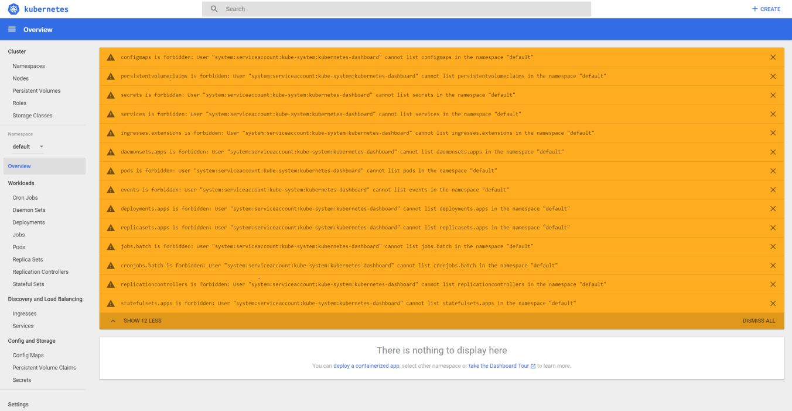

# Configurations you need to start a kubernetes cluster

### Dependencies

`kubectl apply -f 0_dependencies`

### Load Balancer
`kubectl apply -f 1_load-balancer`
### Ingress service
`kubectl apply -f 2_ingress-service`
### Heapster Monitoriong
Needed to use Horizontal Pod Autoscaler.
`kubectl apply -f 3_heapster`
### Prometheus and Graphana
`kubectl apply -f 4_prometheus`


## Automation

`chmod +X deploy.sh`

`./deploy.sh`


## Access dashboard on AKS with RBAC enabled

`kubectl create clusterrolebinding kubernetes-dashboard -n kube-system --clusterrole=cluster-admin --serviceaccount=kube-system:kubernetes-dashboard`




## Helm

To install helm-cli run `curl -L https://git.io/get_helm.sh | bash`

`kubectl apply -f helm-rbac.yaml`

`kubectl create serviceaccount --namespace kube-system tiller`

`kubectl create clusterrolebinding tiller-cluster-rule --clusterrole=cluster-admin --serviceaccount=kube-system:tiller`

`kubectl patch deploy --namespace kube-system tiller-deploy -p '{"spec":{"template":{"spec":{"serviceAccount":"tiller"}}}}'`

`helm init --service-account tiller --node-selectors "beta.kubernetes.io/os"="linux" --upgrade`

### Private Ingress

Create a namespace for the ingress resources
`kubectl apply -f backend-namespace.yaml`

Use Helm to deploy an NGINX ingress controller

```Javascript
helm install stable/nginx-ingress \
    --namespace backend \
    -f internal-ingress.yaml \
    --set controller.replicaCount=2 \
    --set controller.nodeSelector."beta\.kubernetes\.io/os"=linux \
    --set defaultBackend.nodeSelector."beta\.kubernetes\.io/os"=linux
```


### Author

**Ismael Leiva**

* [github/isma90](https://github.com/isma90)
* [dockerhub/ismaleiva90](https://hub.docker.com/u/ismaleiva90)
* [stackoverflow/isma90](https://stackoverflow.com/users/2043313/isma90?tab=profile)

### License

Copyright © 2017, [Ismael Leiva](https://github.com/isma90).
Released under the [MIT License](LICENSE).


### Credit

This repository was heavily inspired by the implementation in [giantswarm/prometheus](https://github.com/giantswarm/prometheus)

#### Bibliography

* [AKS Kubernetes Helm](https://docs.microsoft.com/es-es/azure/aks/kubernetes-helm)
* [Install Helm helm.sh](https://helm.sh/docs/using_helm/#installing-helm)
* [Private ingress AKS](https://docs.microsoft.com/en-us/azure/aks/ingress-internal-ip)

